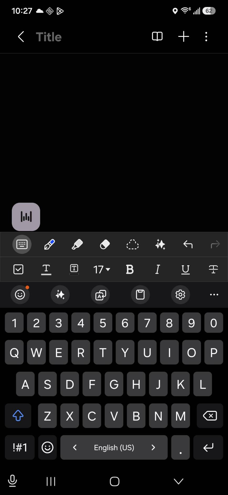
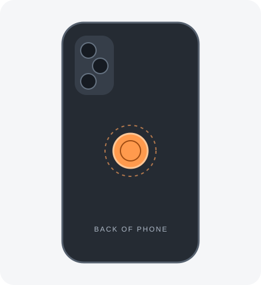
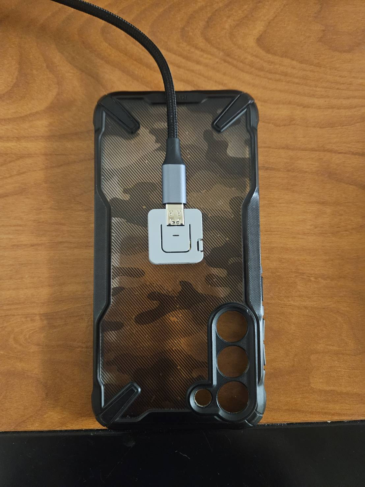
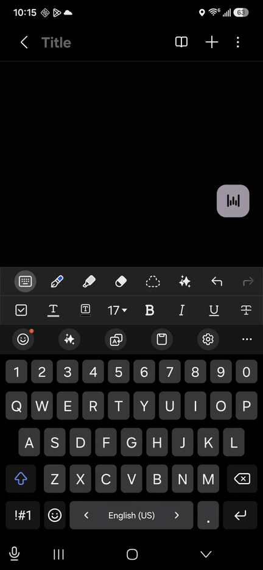

# Tap — ATOM prototype

Since ~May 2026, I use Wispr Flow a lot on my MacBook. I press Fn, talk, and the text shows up. At this point it’s muscle memory.

But I don’t really use it on my phone. Having to tap a floating button feels awkward, and sometimes it gets in the way of something else I’m trying to touch. It works, but I don’t find myself reaching for it the way I do desktop. 

So I wanted to try putting a physical button on the back of my phone. Something I could press without looking, like Fn on my MacBook.

This is the first rough version of that idea. It’s an ATOM Lite connected to an Android phone over Bluetooth. You can tap to start and stop dictation, or hold the button while you talk. The phone records your voice and turns it into text with STT models and outputs in straight in your inbox, just like how Wispr Flow works. 

The hardware only tells the phone when it’s pressed or released, so another app could use it for something completely different.

That’s also why I think this could be useful for agents. Maybe you press a button, say what you want, and let an agent get started. Our phones already have most of what’s needed. I’m interested in what happens when we give them a physical control that makes those interactions easier. Perhaps AI hardware doesn't really need to be reinvented, but instead integrated into our devices. What if this could activate my remote Hermes agent? What if I could just activate my model with a touch instead of navigating to the right app, chat, and text boxes? 

For now, this is a pretty rough hardware prototype. It works well enough to test the idea, and the next step is figuring out how to make the actual button fit and feel right.

## Why a physical button?

The starting point was mobile dictation controlled through a floating on-screen button. In this Samsung Notes setup, Wispr Flow's control sits above the keyboard. Tap explores moving that interaction to a physical button, so recording can be started and stopped without reaching for an on-screen control. 



*Wispr Flow on Mobile*

## The prototype

Tap is a physical input button for mobile applications. This repository preserves the first working implementation: a USB-powered M5Stack ATOM Lite, a BLE interface, and an Android dictation example.

The hardware reports presses and releases; the phone decides what they do. Fish Audio provides speech-to-text for the example client. Other applications could use the same button for different actions by integrating the BLE interface or Android library.

The idea is to put the button on the back of the phone, where you can press it by feel while holding it. This first version uses a separate USB-powered ATOM to test the interaction; the case and mounting are still to be worked out.





*The ATOM Lite on a phone case, with USB power connected. A rough test of where the button could sit.*

- **Tap to toggle:** tap to start recording, then tap again to stop and transcribe.
- **Hold to talk:** hold until the readiness vibration, speak, and release to transcribe.
- **Insert or copy:** text goes into a compatible field selected when recording starts. If there is no suitable field, or it changes during recording, the result is offered for copying.



Tap-to-toggle on the Samsung Galaxy S23+, with Fish Audio transcription inserted into Samsung Notes.

The microphone records only during dictation, and completed recordings are sent to Fish Audio for transcription.

## Prototype limits

This version has to stay plugged into USB, and there's no case or mounting for it yet. It was mostly built to test the BLE connection, the button interactions, and whether Android could handle dictation across apps. The hardware is still pretty rough.

Ideally, the button would feel like part of the phone. It could fit into a phone case, sit flush enough that you can lay the phone down normally, and potentially get power wirelessly from the phone. There's still a lot to figure out around power, thickness, placement, and how the button actually feels to press.

## Architecture

```text
Physical button → BLE events → Android client → recording → Fish Audio → text
```

- [firmware/](firmware/) reads the ATOM's built-in switch on GPIO39, applies 35 ms debounce, and publishes button state over BLE.
- [button-android/](button-android/) manages the connection and reports validated press, release, and signal-loss events. It is independent of recording and transcription.
- [app/](app/) interprets taps and holds, records through the phone microphone, and handles transcription and text delivery. A foreground service keeps the button available across apps.

The firmware has no microphone or knowledge of AI services. Gesture behavior belongs to the client. Applications such as Wispr Flow or another voice agent would need to integrate the button interface themselves.

## Setup

You need an **M5Stack ATOM Lite**, a USB cable, an **Android 13+ phone**, and a **Fish Audio API key** with transcription credits. The prototype was tested on a Samsung Galaxy S23+ running Android 16. The firmware commands below use macOS serial-port paths; run them from the repository root.

### 1. Flash the ATOM

Connect the board over USB. Install the pinned firmware tools and upload the firmware, replacing `/dev/cu.YOUR_BOARD` with the board's serial port:

```sh
python3 -m venv "$HOME/Library/Caches/tap-tools/venv"
source "$HOME/Library/Caches/tap-tools/venv/bin/activate"
python -m pip install -r firmware/requirements.txt
pio run -d firmware -t upload --upload-port /dev/cu.YOUR_BOARD
```

Keep any serial monitor closed while flashing. USB also powers the board during use. The large built-in button is the input; the small reset switch restarts the board.

### 2. Install Tap

Open the repository in Android Studio. Use JDK 17 or 21 and install Android SDK Platform 35 and Build Tools 35.0.0. Connect the phone with USB debugging enabled, select the `app` run configuration and your phone, then click **Run**.

### 3. Configure the phone

1. In Tap, select **Text insertion**, then enable **Tap dictation** in Android accessibility settings. If Android restricts the sideloaded app, enable **Allow restricted settings** in its app-info menu before trying again.
2. Allow **Microphone** access. Dictation becomes ready automatically; no switch is required. Notifications are optional, but allowing them makes the ready notification visible.
3. Provision the Fish Audio key from the local `.env` file using the steps below.
4. Enable Bluetooth, keep the ATOM powered, and select **Bluetooth button → Connect**. Allow **Nearby devices** access and wait for **Connected**.

Keep your existing keyboard. No separate **Display over other apps** permission is needed. Missing permissions or a disconnected button appear in red.

Create a `.env` file in the repository root with your key:

```dotenv
FISH_AUDIO_KEY=your_key
```

Get the phone's serial from `adb devices -l`, then provision the installed debug app:

```sh
python3 scripts/provision_fish_key.py --serial SERIAL
```

The script copies the key into app-private storage on the phone. The build does not read `.env` or embed the key in the APK. `.env` is Git-ignored; keep the key out of commits and logs. Reprovision after uninstalling the app or clearing its data. Manual entry through **Transcription → API key** remains available as an alternative.

### 4. Try dictation

Select a text field and tap twice, or hold and release. A passive waveform shows recording and processing. When insertion is unavailable, use **Copy** on the floating result or copy the last transcript from Tap. Errors and transcription retry controls appear in the app's settings.

## BLE reference

Interface v1 and Android integration

The button is a BLE peripheral; the phone is the central. Discover it by the advertised service UUID. The state characteristic supports reads and notifications, with no writes.


| Item                 | UUID                                   |
| -------------------- | -------------------------------------- |
| Button service       | `b8b10001-64df-4f6d-b7d1-86a6e72f8d21` |
| State characteristic | `b8b10002-64df-4f6d-b7d1-86a6e72f8d21` |
| CCCD                 | `00002902-0000-1000-8000-00805f9b34fb` |


Write `01 00` to the CCCD to enable notifications. Reads and notifications use the same six-byte payload:


| Offset | Bytes | Meaning                                       |
| ------ | ----- | --------------------------------------------- |
| 0      | 1     | Version: `01`.                                |
| 1      | 1     | State: `00` released, `01` pressed.           |
| 2      | 4     | Unsigned 32-bit edge sequence, little-endian. |


The sequence starts at zero on boot and increments on each debounced transition, including while disconnected, wrapping modulo 2^32. A hold produces one press and one release. Long press and double press are interpreted by the client.

After enabling notifications, read the current state to establish a baseline. This read must not generate a synthetic press. The Android library rejects invalid packets, ignores duplicate or old notifications, and reports interrupted continuity when the sequence or state progression is unexpected. The client cancels its active gesture and waits for fresh input. There is no replay queue; a missing final release cannot be detected until another packet or a disconnection reveals the problem.

Another Android client can depend on `implementation(project(":button-android"))` and use press, release, and signal-loss callbacks. Methods and callbacks run on the main thread. The host owns runtime permissions, background listening, and gesture policy.

Implementation details: [firmware](firmware/src/main.cpp), [event validation](button-android/src/main/java/dev/backbutton/button/ButtonEvents.kt), and [Android connection](button-android/src/main/java/dev/backbutton/button/BleButtonConnection.kt).

## Validation and limitations

Tap and hold were tested on the physical Samsung, including dictation into LINE and browser fields. Emulator checks cover text insertion, recording across editor changes, transcript recovery, permission reporting, and recording/persistence failures. Automatic activation and background availability were also checked.

This version has a few practical limits:

- USB power and the ATOM's built-in switch; no battery or integrated phone case.
- One active BLE client, with no authenticated pairing or bonding.
- One automatic reconnect attempt after a ready connection is lost. Other failed connections need an explicit retry.
- Text insertion depends on editor compatibility and an unchanged field; copying is the fallback.
- Background availability depends on Android's service and power management. Open Tap again after an app or phone restart.

Run the Android unit tests and lint:

```sh
./gradlew :app:testDebugUnitTest :button-android:testDebugUnitTest :app:lintDebug :button-android:lintDebug
```

Run the firmware debounce tests:

```sh
c++ -std=c++11 -Wall -Wextra -Werror firmware/tests/button_debounce_test.cpp -o /tmp/tap-debounce-test
/tmp/tap-debounce-test
```

Additional Android integration checks live in [app/src/androidTest/](app/src/androidTest/). They use synthetic transcription and require an emulator or dedicated fixture device without a real Fish Audio key; fixture requirements are documented in the test code.
